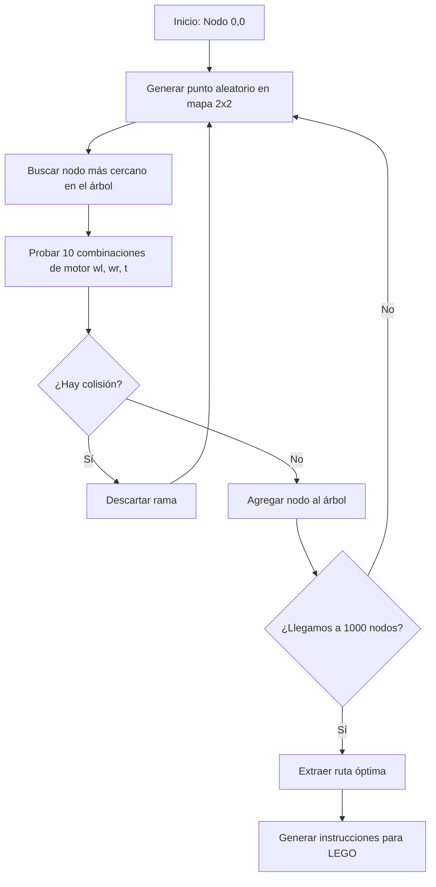
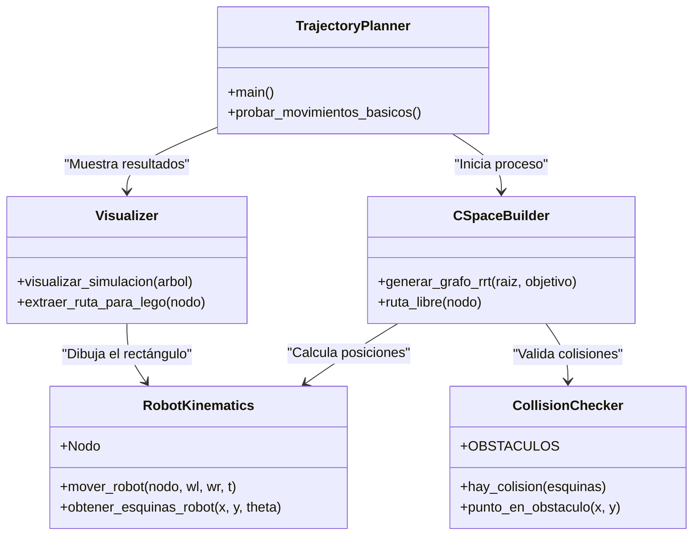

# Reporte de Proyecto: Planificación de Movimientos - Robot LEGO

## Datos Generales
**Institución:** Instituto Tecnológico Superior de Salvatierra  
**Carrera:** Ingeniería en Tecnologías de la Información y Comunicaciones  
**Periodo:** Enero-Junio 2026  
**Materia:** Planificación de Movimientos  
**Profesor:** Dr. Francisco Javier Montecillo Puente  
**Alumno:** Isaac Ortiz Arias

---

## 1. Objetivo SMART
Implementar un plan de movimientos en el prototipo físico del kit LEGO, generado a partir de un algoritmo de planificación cinemático que integre un modelo matemático, planificador de trayectorias, colisionador y simulador.

---

## 2. Introducción
La planificación de movimientos es una disciplina fundamental en la robótica moderna, con aplicaciones directas en vehículos autónomos, drones y sistemas industriales. Este proyecto se enfoca en el desarrollo de un sistema completo para un robot de tracción diferencial, cubriendo desde el modelado cinemático hasta la ejecución en hardware real.

---

## 3. Modelo Cinemático 2D (Tracción Diferencial)
Para un robot con dos ruedas motrices independientes, la postura se define como $q = [x, y, \theta]^T$.

### 3.1 Ecuaciones de Movimiento
Considerando:
- $r$: Radio de las llantas.
- $L$: Distancia entre llantas.
- $\omega_L, \omega_R$: Velocidades angulares de las llantas (corresponden a `dth_left` y `dth_right`).

Las velocidades lineales de cada rueda son:
$$v_L = r \cdot \omega_L$$
$$v_R = r \cdot \omega_R$$

La velocidad lineal ($v$) y angular ($\omega$) del robot son:
$$v = \frac{v_R + v_L}{2}$$
$$\omega = \frac{v_R - v_L}{L}$$

El modelo cinemático resultante es:
$$\begin{bmatrix} \dot{x} \\ \dot{y} \\ \dot{\theta} \end{bmatrix} = \begin{bmatrix} \cos(\theta) & 0 \\ \sin(\theta) & 0 \\ 0 & 1 \end{bmatrix} \begin{bmatrix} v \\ \omega \end{bmatrix}$$

---

## 4. Metodología
Para cumplir con los requisitos del examen, se sigue el siguiente flujo de trabajo:

### 4.1 Construcción del Hardware
Ensamblaje del robot LEGO utilizando el kit Mindstorms, configurado para tracción diferencial con una rueda loca de apoyo.

### 4.2 Definición del Mapa y Obstáculos
Se trabaja sobre un mapa de $2.0 \times 2.0$ metros. Los obstáculos están definidos por las siguientes coordenadas (basadas en la Figura 22):
1. **Obstáculo 1 (Superior Izquierdo):** Rectángulo de $[0.0, 1.0]$ en X y $[1.5, 2.0]$ en Y.
2. **Obstáculo 2 (Centro):** Rectángulo de $[0.5, 1.0]$ en X y $[0.5, 1.0]$ en Y.
3. **Obstáculo 3 (Derecha):** Rectángulo vertical de ancho $0.15$ m.
4. **Obstáculo 4 (Inferior):** Franja de altura $0.1$ m.

### 4.3 Algoritmo de Planificación (Grafo de Espacio Libre)
Se implementa un generador de nodos partiendo del origen $(0.0, 0.0, 0.0)$. 
- Se aplican 10 combinaciones de configuración $(\omega_L, \omega_R, t)$ para cada nodo.
- Se verifica la colisión en cada paso.
- Solo los nodos libres se agregan al grafo hasta alcanzar **1000 nodos válidos**.

### Flujo de generación del C‑Space

---

## 5. Desarrollo de la Simulación (Python)
### Arquitectura del Simulador

---

## 6. Resultados y Ejecución en LEGO
[Documentación de las 3 trayectorias seleccionadas y fotos/links del video de ejecución]

---

## 7. Conclusiones
[Análisis final sobre la precisión del modelo cinemático y la fiabilidad de la detección de colisiones]

---

## 8. Referencias
Material de clase, Dr. Francisco Javier Montecillo Puente.
